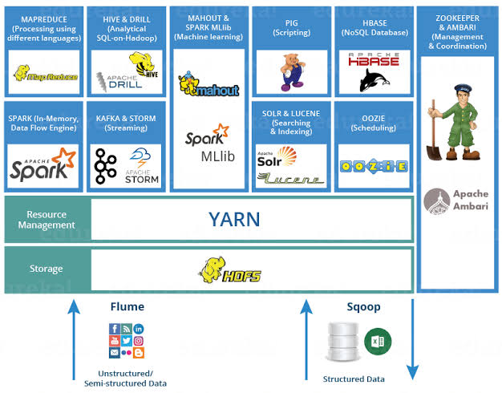
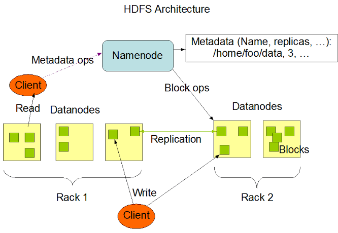
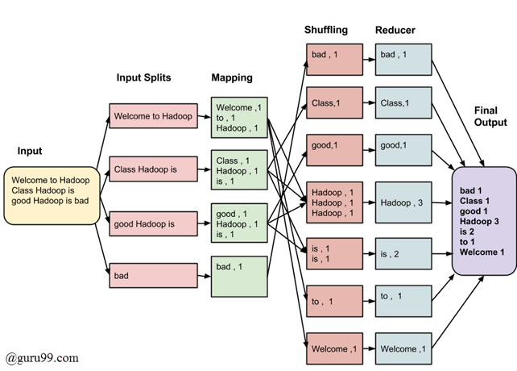
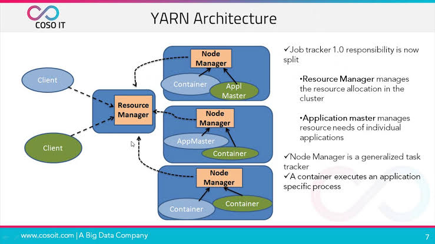

# Hadoop
#### Definition: 

Hadoop is an open source software platform for distributed storage
and distributed processing of very large data sets on computer 
clusters built from commodity hardware.

#### Distributed storage in Hadoop

HDFS ( Hadoop Distributed file system) is a distributed file system
    designed to store large volumes of data.

    - It is designed with low cost hardware.
    - Provides access to data across multiple Hadoop clusters.
    - It has high fault tolerance and throughput.

#### Distributed processing in Hadoop

##### MapReduce  
is programming metphor that is used for processing data into different clusters.

##### YARN ( Yet Another Resource Negotiotor )
 is the cluster resource management layer of the Apache Hadoop Ecosystem, which schedules jobs and assigns resources.

 
    - BATCH [ MapReduce ] 
    - INTERACTIVE( Tez)
    - Column oriencted database(HBASE)
    - Streaming ( Storm )
    - Graph (Giraph )
    - In-Memory( Sparck)

