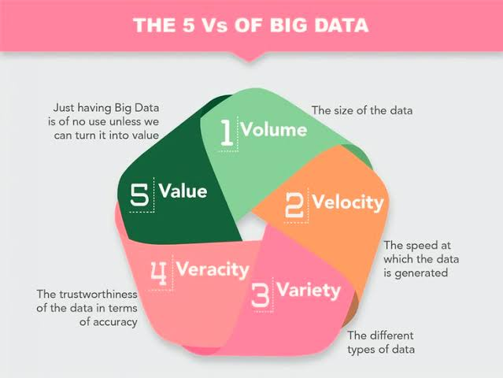
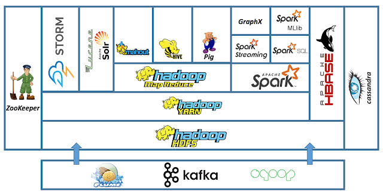
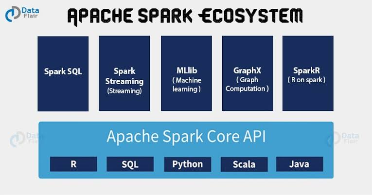
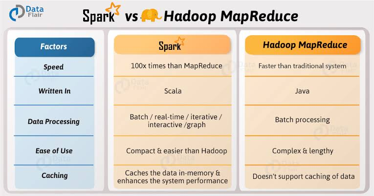

# Big-Data-Analytics-tutorials

Big data is extremely large data sets that may be analysed computationally to reveal patterns, trends, and associations, especially relating to human behaviour and interactions.
#### 5 V's of Big Data:

## Part I. Hadoop

## Part II. Apache Spark

### Hadoop Vs Spark
