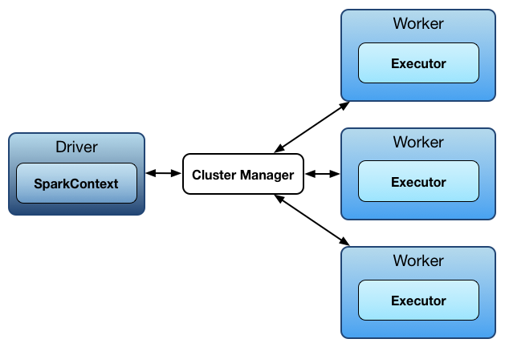

# Apache Spark

Apache Spark is an open-source data processing engine to store and process data in real-time across various clusters of computers using simpe programming constructs.

## Spark Features

#### 1. Fast Processing 

Spark contains Resilient Distributed Datasets(RDD) which saves time taken in reading and writing operations and hence, it runs almost ten to hundred times faster than Hadoop.

#### 2.  In-memory computing

In spark, data is stored in the RAM, so it can access the data quickly and accelerate the speed of analytics.

#### 3. Flexible

Spark support multiple languages. 

#### 4. Fault tolerance

Spark contains RDD that are designed to handle the failure of any worker node in the cluster.
    
#### 5. Better Analytics

Spark has a rich set of SQL queries, ML algorithms, Complex analytics.

## Components of Apache Spark
#### 1. Spark Core

Spark core is the base engine for large-scale parallel and distributed data processing. Spark core is embedded with RDDs(Resillent Distributed dataset). an immutable fault-tolerant, distributed collection of objects that can be operated on in parallel.

RDD operations : Transformation and Action.

#### 2. Spark SQL

Spark SQL framework component is used for structured and semi-structured data processing.

#### 3. Spark Streaming

Spark streaming is a lightweight API that allows developers to perform batch processing and real-time streaming of data with ease.

#### 4. Spark MLlib

MLlib is a low-level machine learning library that is simple to use, is scalable, and compatible with various programming languages.

#### 5. Spark GraphX

GraphX is Spark's own Graph Computation Engine and data source.

## Spark Architecture

